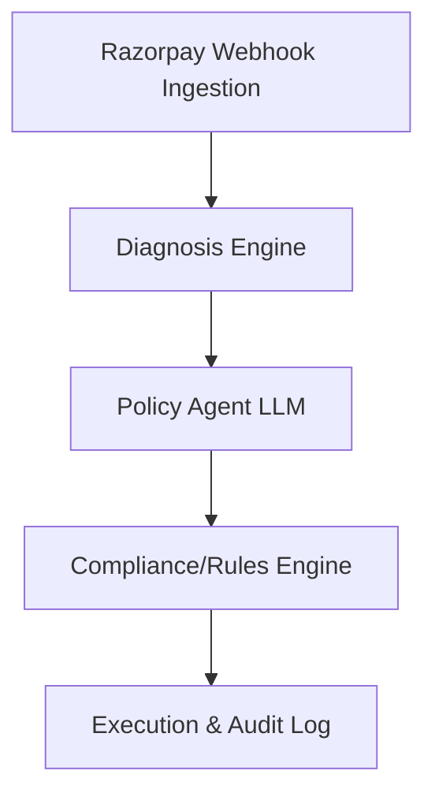

# Recovr Architecture

Recovr is an AI-driven, compliance-bounded revenue recovery engine built for **Razorpay AI Buildathon 2026 (Track 03 - AI Revenue Recovery)**.

The system is organized into a four-stage pipeline:

## 1. Ingestion Layer
* **Razorpay Webhooks**: Ingests payment failure webhooks (`payment.failed`, `subscription.charged` failure responses) for both UPI Autopay and card auto-debit subscriptions.
* **Batch Scheduler**: Periodically polls for eligible retries based on scheduling timers.

## 2. Diagnosis Layer
* **Cause Classifier**: Maps Razorpay payment error codes (e.g., `insufficient_funds`, `bank_timeout`, `mandate_revoked`) into clean internal Failure Causes.
* **Propensity Scoring**: Uses user history and bank reliability trends to calculate repayment propensity score, deciding whether channel-switch notifications or silent retries are most cost-effective.

## 3. Policy Agent (LLM + Rules Engine)
* **LLM Judgement**: Selects the optimal recovery strategy (e.g., WhatsApp payment link nudge vs. scheduled card retry) depending on past attempts and error context.
* **Compliance Rules Engine**: Hard-gates all actions with NPCI/card network rules. Ensures max attempts are respected, retries are restricted to non-peak hours, and hard declines are never retried.

## 4. Execution & Audit Layer
* **Execution Engines**: Handles dispatching retries to Razorpay and messaging nudges via messaging service APIs.
* **Audit Trail**: Maintains an immutable log of every transaction decision showing:
  * Failure cause and current attempt status.
  * LLM chosen strategy.
  * Compliance verification state (Rule applied).
  * Executed action outcome.
